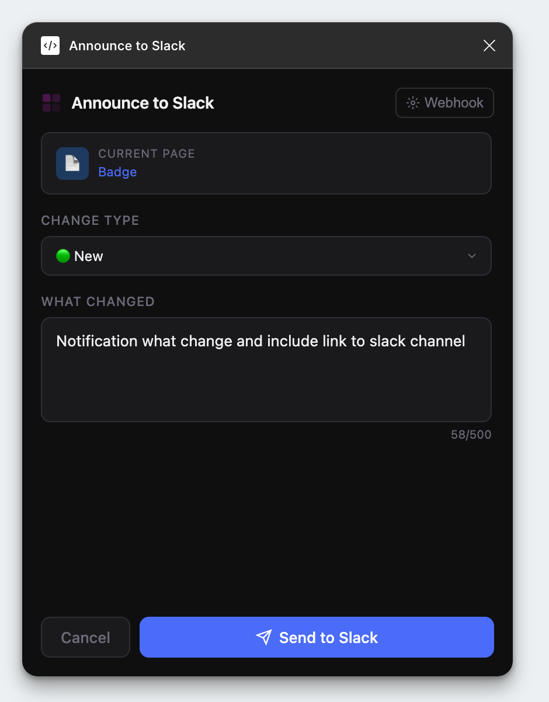
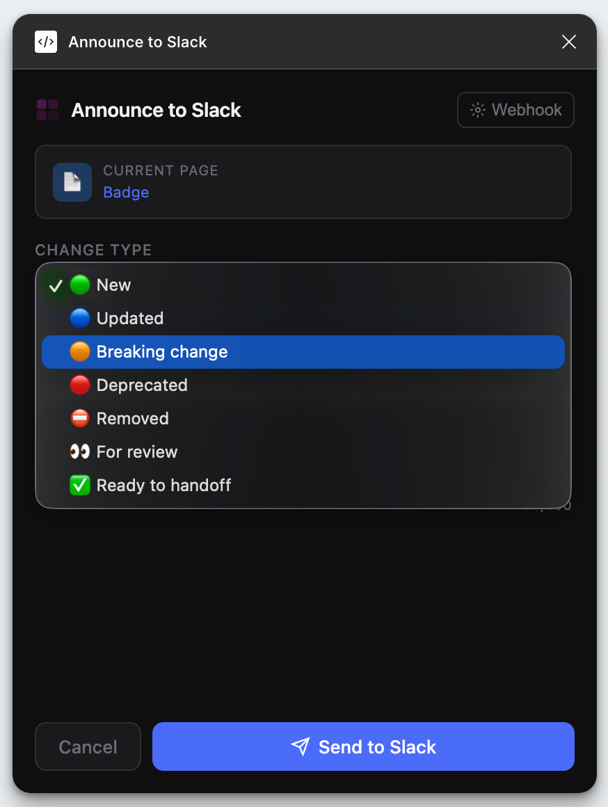

# Figma2Slack — Figma Plugin

Post structured design change announcements to Slack directly from Figma.

## How it works

- **Nothing selected** → uses current page name
- **Frame selected** → uses frame name + deep link to that frame

    
    

## Install locally

1. Open Figma Desktop
2. Plugins → Development → Import plugin from manifest
3. Select the `manifest.json` file in this folder
4. Run: Plugins → Development → Figma2Slack

## Setup

1. Go to [api.slack.com/apps](https://api.slack.com/apps)
2. Create App → From Scratch
3. Incoming Webhooks → Activate → Add New Webhook → pick channel
4. Copy the webhook URL (starts with `https://hooks.slack.com/services/...`)
5. In the plugin, click **Webhook** → paste URL → Save

Webhook is saved locally to Figma (per machine, not shared with the file).

## Slack message format

```
🎨 Design update
Updated hover state on Button, added disabled variant

🖼 ButtonPrimary · Open in Figma →
```

## Notes

- Figma deep links require the file to be shared (view access minimum)
- `figma.fileKey` is available in Figma Desktop and web editor
- Network fetch runs from the UI iframe (not the plugin sandbox), so Slack webhooks work without special permissions
